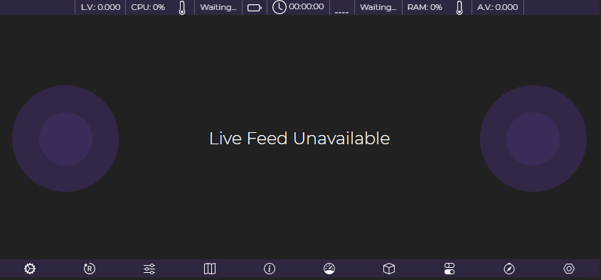
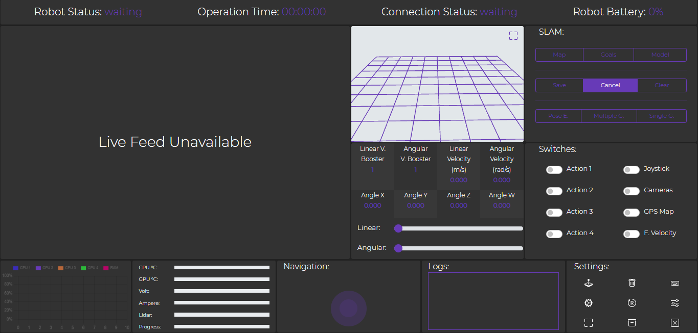

# Multiplatform ROS remote controller

This repository contains remote controllers for multiple robots, extensively tested with ROS1 across various robotic platforms. These controllers enable seamless remote operation and interaction with autonomous systems. Designed for flexibility and reliability, they are continuously refined to support new research and development needs:

* Clearpath jackal
* Clearpath husky
* SOUP robot (tomato harvester)
* Custom made robots for agriculture

# ROS Platforms

* ROS 2 never tested.
* Tested on ROS Melodic.
* Tested on ROS Noetic.

## Controllers

* [robot-app](https://github.com/georgealexakis/multiplatform_ros_remote_controller/tree/main/robot-app): The robot-app package is the main robot controller that has build for mobile devices. Just clone it and run `npm install` to download the packages.



* [robot-controller](https://github.com/georgealexakis/multiplatform_ros_remote_controller/tree/main/robot-controller): The robot-controller package is the main robot controller that has build for desktop devices. Just clone it and run `npm install` to download the packages.



I have used Cordova and Electron to build the hybrid apps for the native installation and running.

## System Technologies

The frameworks and the libraries that have been used for the development are presenting below:
* Bootstrap library: HTML DOM and UI library.
* three.js: 3D modeling for the arm movements.
* roslib.js: Connection with ROS over WebSocket protocol.
* mjpegcanvas.js: Live feed from multiple cameras.
* ros3d.js: Display 3D model of the robot (Not yet included).
* ros2d.js: Display 2D map (Not yet included).
* nav2d.js: Experiments for sending goals over 2D map.
* nipplejs.js: Joystick for manual navigation. 
* Chart.js: Library for the statistics chart.
* jquery.js: Necessary library for miscellaneous functionalities.

## Installation for Robot Monitor Package (optional)

For the installation process the user have to copy the package of robot_monitor in the assets folder of the controller into the catkin/src folder and then to build the project by using the command 

`$ catkin_make`

The package is a very simple python node that is sending the diagnostics to the Robot Controller and contains some demo models for demonstration purposes. The controller files have to be pasted into the device that the controller is going to run. When the steps above have completed the user is ready to run the controller.

### Necessary ROS Packages and Libraries

For the successfully connection between ROS and the Controller it is necessary to be installed some ROS packages. Moreover it is necessary to be installed some Python libraries for data transmission and for computer statistics. Below are presenting the packages and the libraries with the necessary command for the installation.

Copy package robot_monitor to catkin_ws/src and: 
```
$ git clone https://github.com/RobotWebTools/tf2_web_republisher/tree/master
$ catkin_make
```

Python library: 
```
$ pip install psutil
```

ROS Packages:
```
$ sudo apt-get install ros-<ROS-VERSION>-tf2-ros 
$ sudo apt-get install ros-<ROS-VERSION>-map-server 
$ sudo apt-get install ros-<ROS-VERSION>-usb-cam 
$ sudo apt-get install ros-<ROS-VERSION>-web-video-server 
$ sudo apt-get install ros-<ROS-VERSION>-rosbridge-server 
$ sudo apt-get install ros-<ROS-VERSION>-joint-state-publisher 
```

## Start Up 

Firstly the user has to run the command below. This launch files runs the necessary packages for the 
right connection, such as the rosbridge package, the web_video_server package and others. The user 
has the option to publish and subscribe to multiple topics which are essential for the controller 
operation.

`$ roslaunch robot_monitor monitor.launch`

The user can run the Web Robot Controller/Web Robot Application by running the index.html file as a simple webpage with the browser. The Robot Controller/App has been tested only with Google Chrome but it can run with the other browsers with any problem.

The steps that the user has to follow for the right connection are:
* Connect to the rosbridge-server.
* Connect to the desired topics.
* Press close to navigate to the main screen.

You can find more instruction to the README of each controller.

# Contributions

For any contributions, please contact me.