# multiplatform_ros_remote_controller

This repo contain remote contollers for multiple robots. Both have extensively tested with ROS1 and multiple robots:

* Clearpath jackal
* Clearpath husky
* SOUP robot (tomato harvester)
* Custom made robots for agriculture

ROS 2 never tested.

## Controllers

* [robot-app](https://github.com/georgealexakis/multiplatform_ros_remote_controller/tree/main/robot-app): The robot-app package is the main robot contoller that has build for mobile devices. Just clone it and run  `npm install` to download the packages.

* [robot-controller](https://github.com/georgealexakis/multiplatform_ros_remote_controller/tree/main/robot-controller): The robot-controller package is the main robot contoller that has build for desktop devices. Just clone it and run  `npm install` to download the packages.

I used Cordova and Electron to build the hybrid apps for the native installation and running.

## System Overview

UI Design & Project Requirements 
The UI design and the basic structure of the controller follow the principle that information must be 
visualized in full screen of the device. So the structure of the UI is divided into multiple tiles that provide 
the essential information or include triggers for different actions. The figures below are presenting the 
initial stages of the design and the last figure is presenting the final structure. Of course the design will 
be updated for any new requirement of the laboratory team. The final implementation consists of two 
main screens. The first screen is the connection panel and the second screen is the main controller 
panel.

The frameworks and the libraries that have been used for the development are presenting below: 
* Bootstrap library: HTML DOM and UI library. 
* three.js: 3D modeling for the arm movements. 
* roslib.js: Connection with ROS over WebSocket protocol. 
* mjpegcanvas.js: Live feed from multiple cameras. 
* ros3d.js: Display 3D model of the robot (Not yet included). 
* ros2d.js: Display 2D map (Not yet included). 
* nav2d.js: Experiments for sending goals over 2D map. 
* nipplejs.js: Joystick for manual navigation. 
* Chart.js: Library for the statistics chart. 
* jquery.js: Necessary library for miscellaneous functionalities.

## Installation for Robot Monitor Package

For the installation process the user have to copy the package of robot_monitor in the assets folder of 
the controller into the catkin/src folder and then to build the project by using the command 

`$ catkin_make`

The package is a very simple python node that is sending the diagnostics to the Robot Controller and 
contains some demo models for demonstration purposes. The controller files have to be pasted into the 
device that the controller is going to run. When the steps above have completed the user is ready to run 
the controller. 
Necessary Packages and Libraries 
For the successfully connection between ROS and the Controller it is necessary to be installed some ROS 
packages. Moreover it is necessary to be installed some Python libraries for data transmission and for 
computer statistics. Below are presenting the packages and the libraries with the necessary command 
for the installation. 
Single ROS package: 

* Copy package to catkin_ws/src: 
```
$ git clone https://github.com/RobotWebTools/tf2_web_republisher/tree/master
$ catkin_make
```

Python Libraries: 
* $ sudo apt-get install python-pip 
* $ pip install psutil 
* $ pip install paho-mqtt 

ROS Packages: 
* $ sudo apt-get install ros-melodic-tf2-ros 
* $ sudo apt-get install ros-melodic-map-server 
* $ sudo apt-get install ros-melodic-usb-cam 
* $ sudo apt-get install ros-melodic-web-video-server 
* $ sudo apt-get install ros-melodic-rosbridge-server 
* $ sudo apt-get install ros-melodic-joint-state-publisher 

## Start Up 

Firstly the user has to run the command below. This launch files runs the necessary packages for the 
right connection, such as the rosbridge package, the web_video_server package and others. The user 
has the option to publish and subscribe to multiple topics which are essential for the controller 
operation. 
* $ roslaunch robot_controller controller.launch

In the right is presenting the terminal after the execution of the command above and in the left is 
presenting the joint state publisher that is able to move the 3D model joints. This joint represents the 
demo model only.

Now the user can run the Web Robot Controller by running the index.html file as a simple webpage with 
the browser. The Robot Controller has been tested only with Google Chrome but it can run with the 
other browsers with any problem. The first screen that is displayed to the user is the connection page in 
which the user can connect to the server. Afterwards the user can connect with the desired topics and 
display the existing topics. The steps that the user has to follow for the right connection are: 
* Connect with the server. 
* Connect the topics. 
* Press close to navigate to the main screen.

Robot Controller has divided in multiple tiles which display essential information or give the access to 
the user to crucial operations. The figure below is presenting briefly every tile of the controller and its 
functionality.

## Screen Captures

## Screenshots


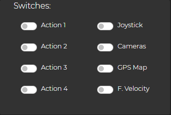


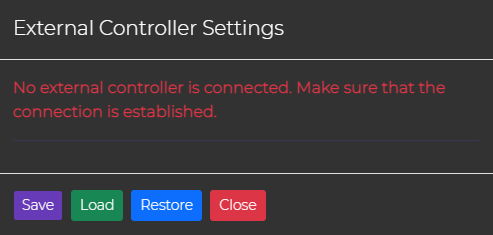

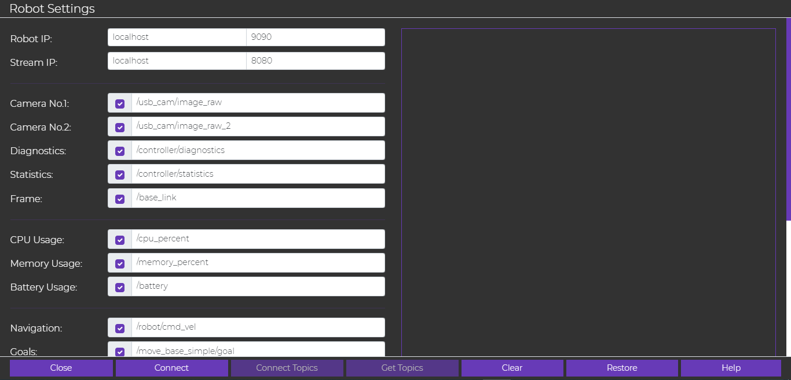

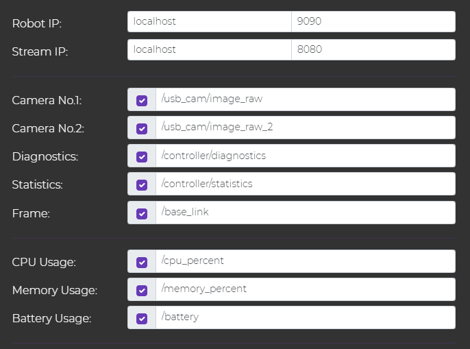

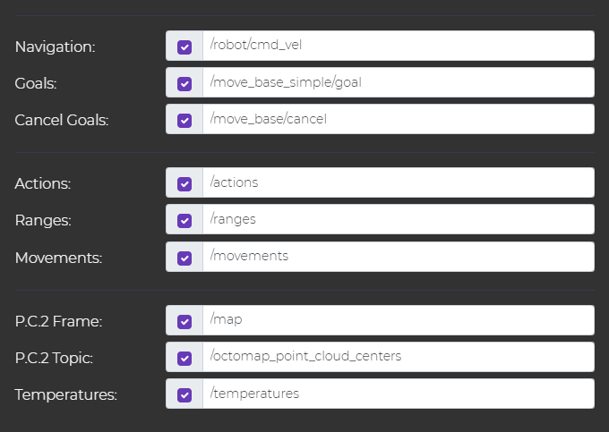

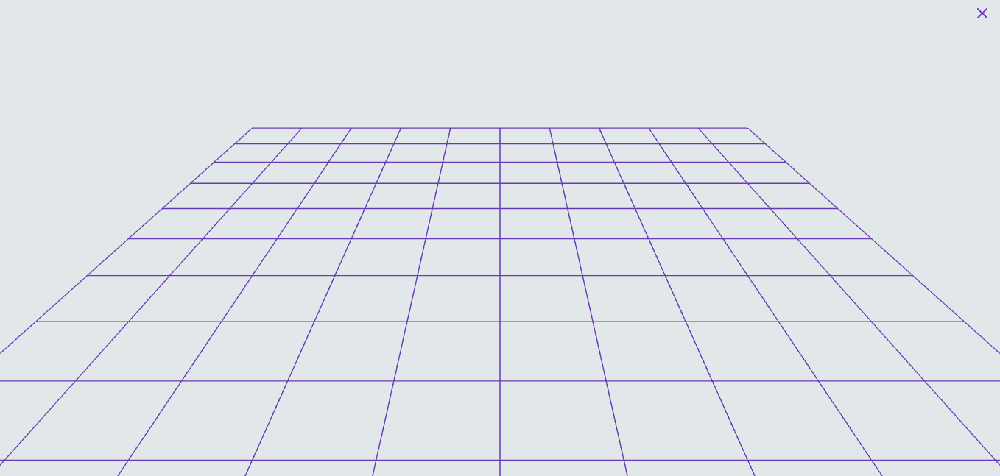

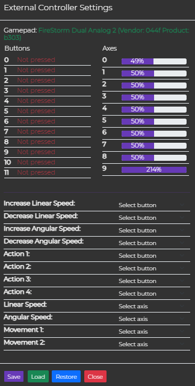


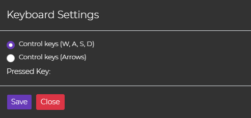

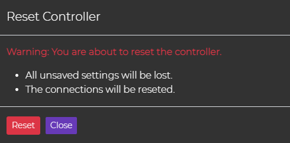

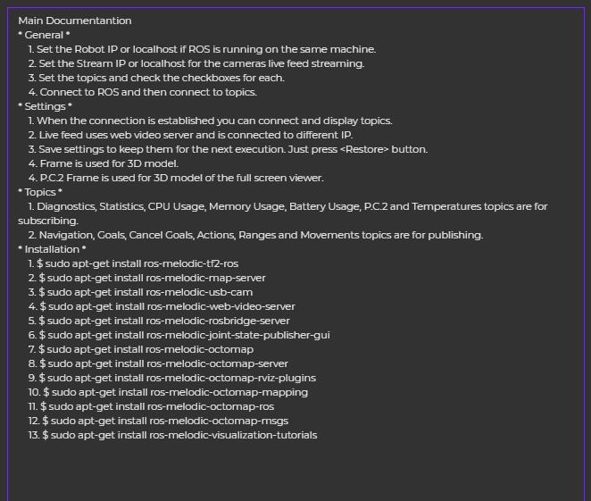

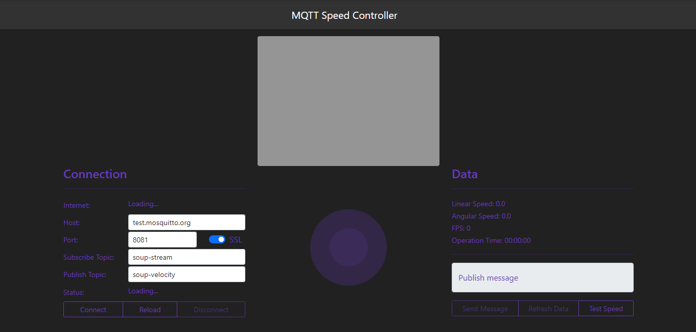

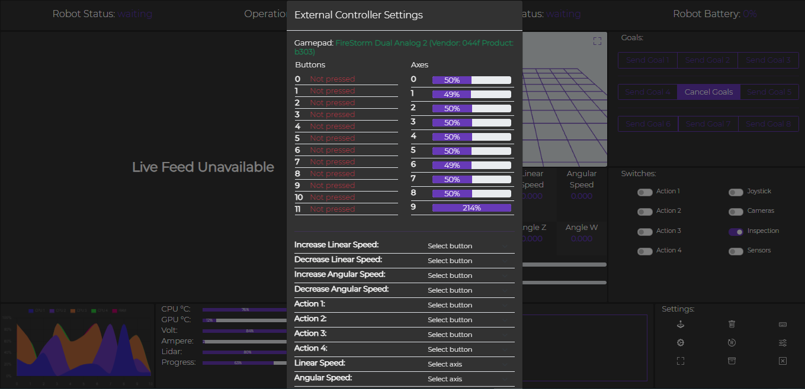

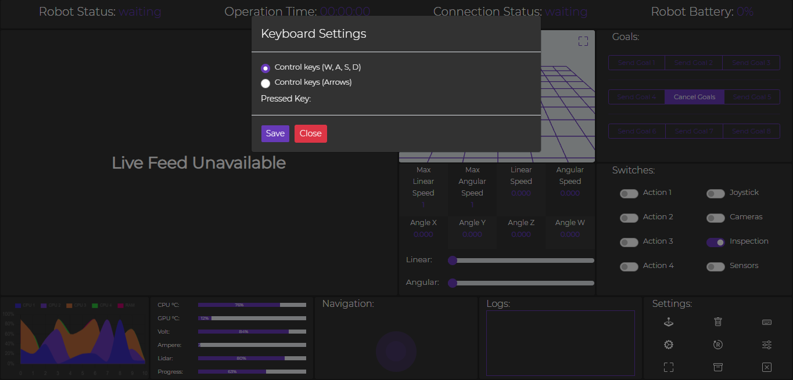

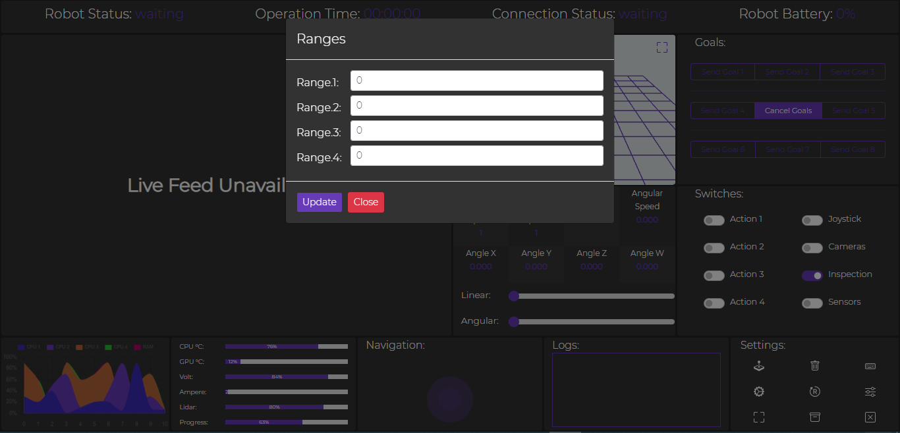

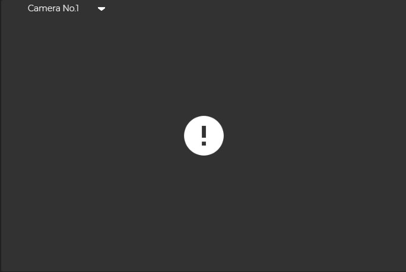

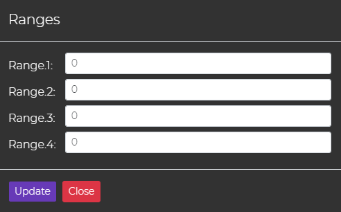

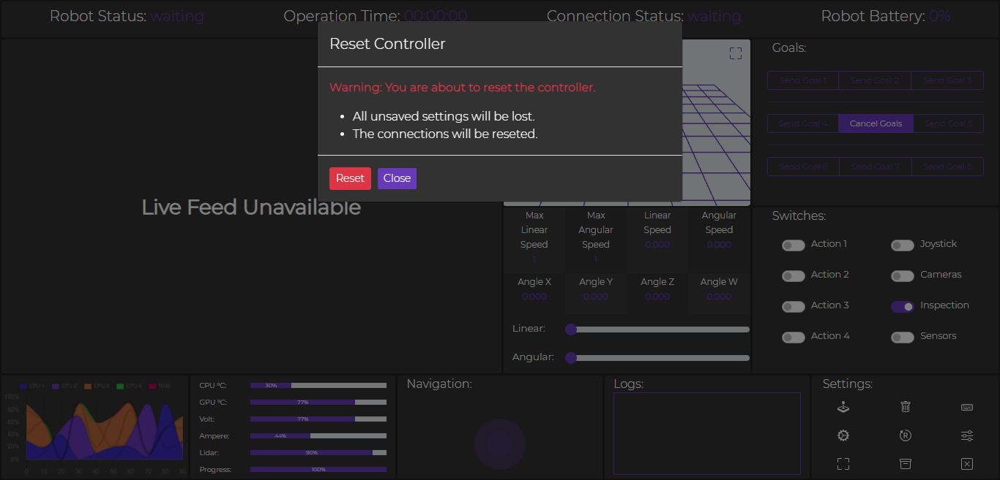

# Contributions

For any contibutions please contact me.