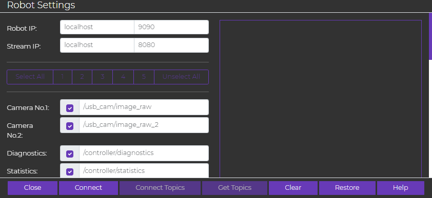
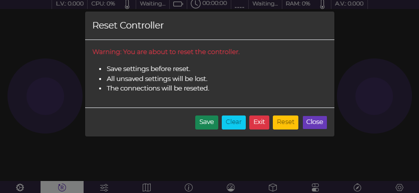
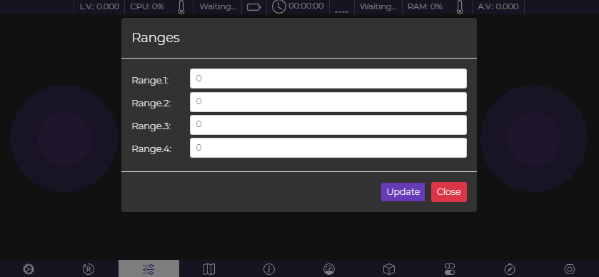
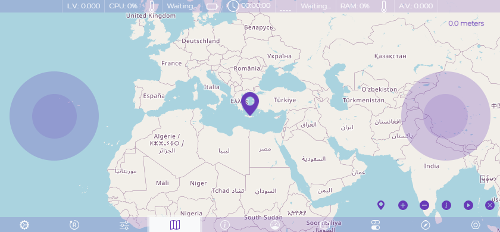
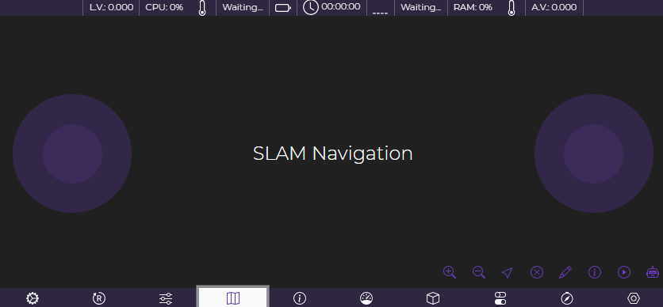
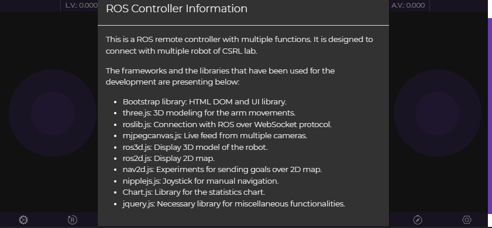
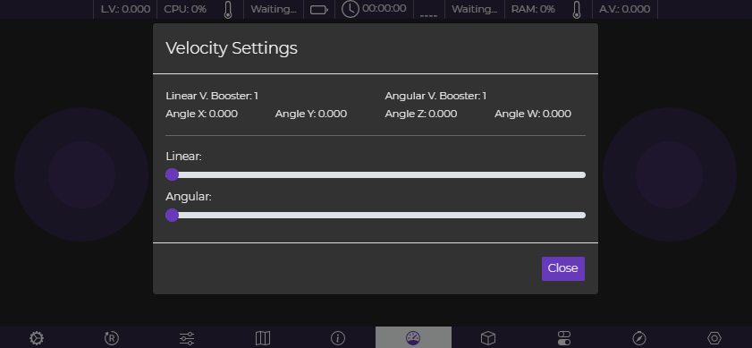
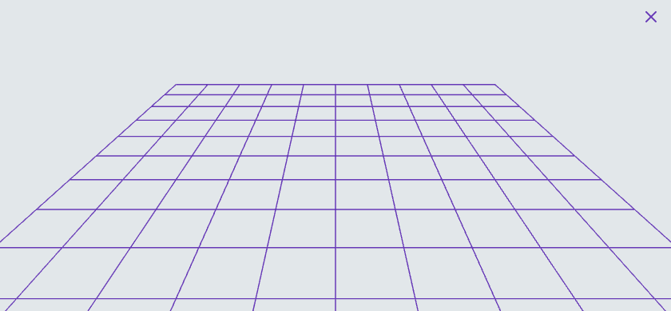
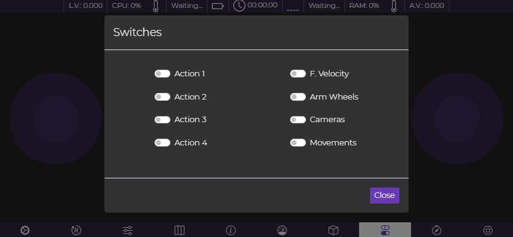
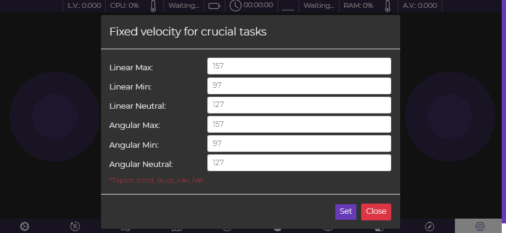

# Robot App

Robot App was developed as part of multiple research projects on autonomous robotics. It is a crucial tool for experiments, providing essential functionality in a mobile-friendly format. As a child application of Robot Controller, it was created to overcome the challenge of carrying a laptop during field tests. A smartphone is sufficient to operate it, offering most of the key features of Robot Controller while enhancing mobility and usability in external locations. Features are continuously added as new research projects require them.

## Features

* Navigation Joysticks for multiple robots.
* Multi-cameras live feed.
* SLAM map.
* Open Street Map.
* ROS logs.
* Multiple buttons for configuration.
* Operation times.
* Robot status and battery.
* Robot PC status (CPU, RAM, etc.)

## Build Robot Controller for android devices

Run to build: $ cordova build android

## Screen Captures

Main screen of the application during startup

By pressing the first icon at the bottom of the screen (gear icon), the configuration on connection panel appears. Set robot IP and the available topics and press 'Connect' and then 'Connect Topics'.

Save option, exit, rest.

Set ranges (requirement of Research project)

Press map icon to display Open Street Map if you use GPS data topics.

Some information about the Application.

Velocity multiplier.

URDF viewer.

Trigger toggle buttons. They send messages with integer types.

Map the maximum and minimum velocities.
