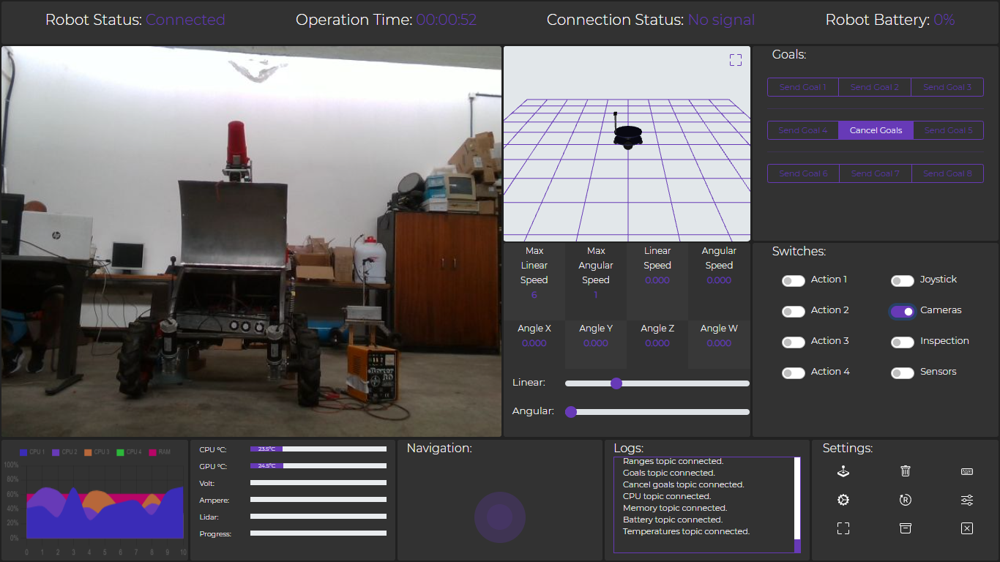
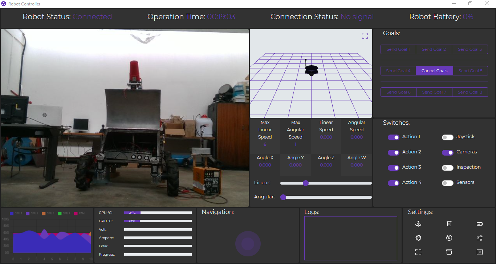
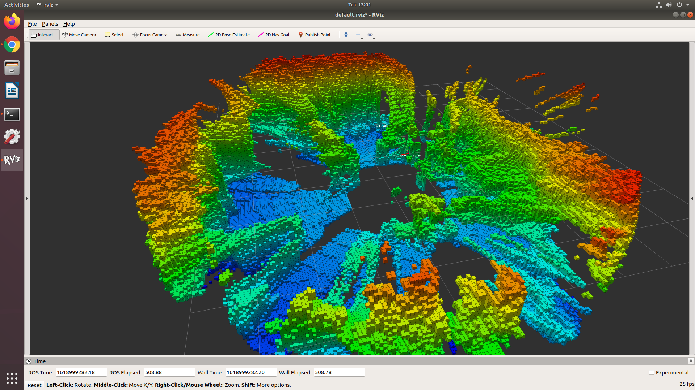
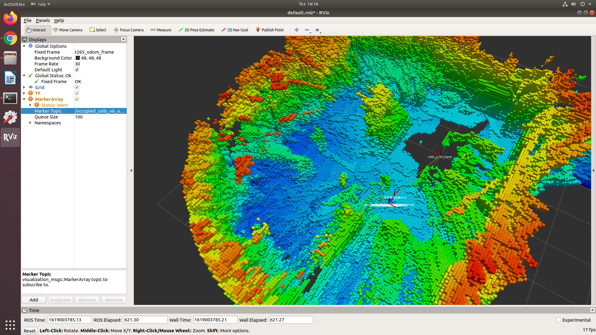
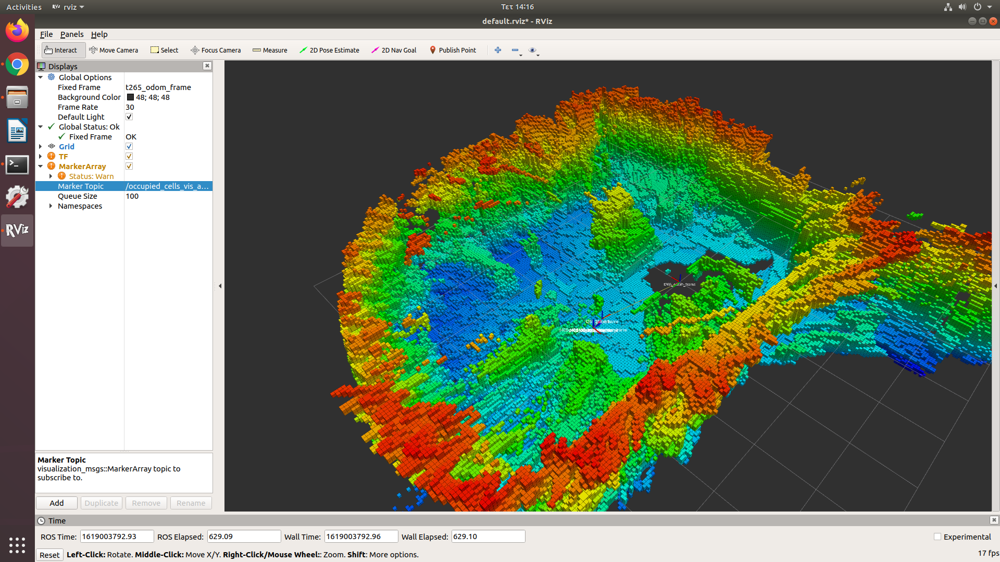

# Robot Controller

Robot Controller is a versatile tool developed as part of multiple research projects focused on autonomous robotics. It serves as a crucial component during experiments, enabling efficient control and adaptation of robotic systems. Features and functionalities are continuously expanded based on the evolving requirements of new research projects.

## Features

* Navigation Joystick for multiple robots.
* External gamepad controller can be used.
* Multicameras live feed.
* SLAM map.
* Open Street Map.
* ROS logs.
* Multiple buttons for configuration.
* Operation times.
* Robot status and battery.
* Robot PC status (CPU, RAM, etc.)

## Installation

Run:

```
npm install
```

then run index.html to your browser.
Follow electron instruction to run this project with electron.

## Export to executable

### Export with electron-packager (recommended)

```
npm install electron-packager -g
electron-packager . --platform=win32 --arch=x64 robot-controller
npm install (Inside build folder)
```

## Export with electron-forge

```
npm install --save-dev @electron-forge/cli
npx electron-forge import
npm run make
npm install (Inside build folder)
```

## Add to .msi installer package

Just if you want to have it as .msi installable package use electron-wix-msi:

```
npm install electron-wix-msi --save-dev
node build_installer.js
```

## Screen Captures

* Main screen of Robot Controller:








* More screens of Robot Controller:


